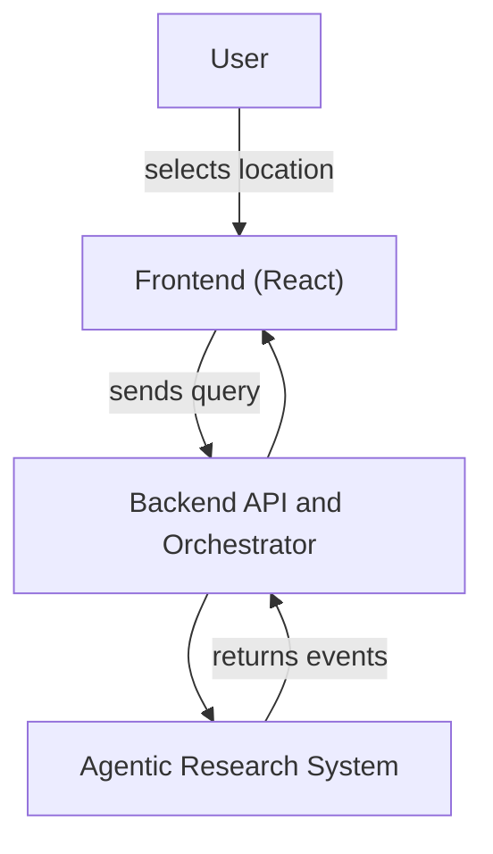

### Time Space

Time Space allows to explore the most impactful events of a specific location.

## Architecture Overview\*\*

## Component Breakdown\*\*

### Frontend\*\*

| **Layer**    | **Tech / Rationale**             |
| ------------ | -------------------------------- |
| UI framework | React + Vite for hot-reload      |
| Mapping      | Leaflet                          |
| Timeline     | Custom component, CSS animations |
| Styling      | Tailwind + shadcn/ui             |

### Agentic Backend

TBD

## Runtime Flow\*\*

1. **User searches** “Berlin”.
2. Frontend posts /query.
3. Agentic workflow searches for sources and identifies when it has enough information for timeline.
4. JSON returned -> timeline cards animate in.
